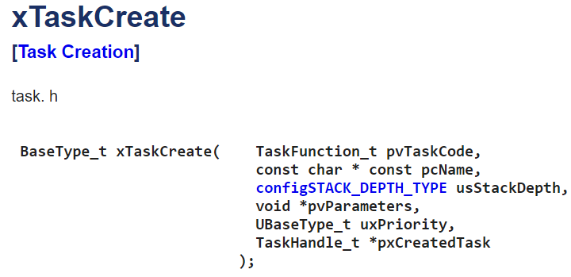

```ino
#include <Arduino_FreeRTOS.h>

void TaskBlink1( void *pvParameters );

void TaskBlink2( void *pvParameters );

void Taskprint( void *pvParameters );

void setup() {

  // comunicacion 9600 bps:

  Serial.begin(9600);

  xTaskCreate(

    TaskBlink1

    ,  "task1"   

    ,  128  

    ,  NULL

    ,  1  

    ,  NULL );

  xTaskCreate(

    TaskBlink2

    ,  "task2"

    ,  128  

    ,  NULL

    ,  1  

    ,  NULL );

    xTaskCreate(

    Taskprint

    ,  "task3"

    ,  128  

    ,  NULL

    ,  1  

    ,  NULL );

vTaskStartScheduler();

}

void loop()

{

}

void TaskBlink1(void *pvParameters)  {

  pinMode(8, OUTPUT);

  while(1)

  {

    Serial.println("Task1");

    digitalWrite(8, HIGH);   

    vTaskDelay( 300 / portTICK_PERIOD_MS ); 

    digitalWrite(8, LOW);    

    vTaskDelay( 400 / portTICK_PERIOD_MS ); 

  }

}

void TaskBlink2(void *pvParameters)  

{

  pinMode(7, OUTPUT);

  while(1)

  {

    Serial.println("Task2");

    digitalWrite(7, HIGH);   

    vTaskDelay( 300 / portTICK_PERIOD_MS ); 

    digitalWrite(7, LOW);   

    vTaskDelay( 300 / portTICK_PERIOD_MS ); 

  }

}

void Taskprint(void *pvParameters)  {

  int counter = 0;

  while(1)

  {

counter++;

  Serial.println(counter); 

  vTaskDelay(500 / portTICK_PERIOD_MS);    }

}
```

PORT B
